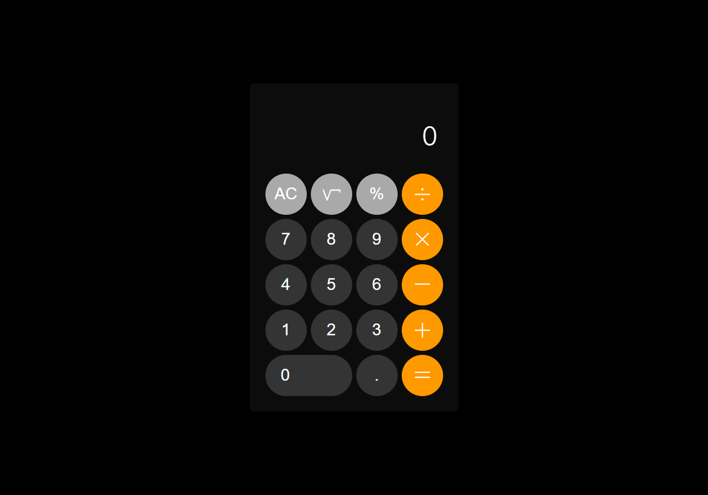

# Calculadora

Projeto desenvolvido para estudo e aplicação de JavaScript.

🔗 [Clique aqui para acessar](https://geovanarochamp.github.io/calculadora/)

## Tarefas

- [X] Criar estrtutura HTML
- [X] Personalizar o layout com CSS
- [X]  Pensar na lógica a ser utilizada no JavaScript
- [X] Criar os eventos nos botões
- [X] Realizar a operação
- [X] Exibir Resultado
- [X] Digitar com o teclado também

## 🛠️ Tecnologias

- HTML
- CSS
- JavaScript
- Git e Github

## 📲 Contato

geovana.rocha.martins@gmail.com
(34) 98407-2980